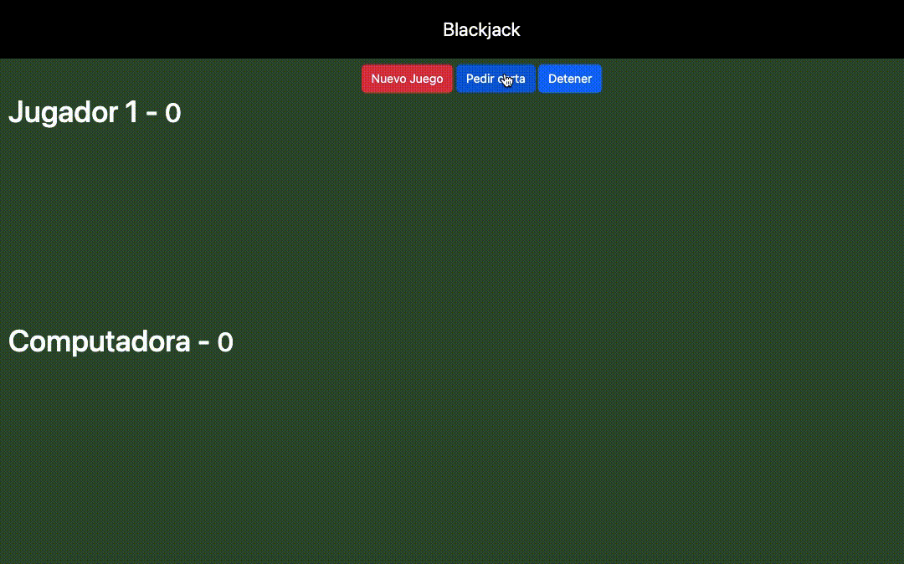

# ♥️♦️♣️♠️ BlackJack ♠️♣️♦️♥️

Juego de 54 cartas de baraja inglesa, en el cual te enfrentaras a la computadora para lograr sacar 21 (o estar lo mas cerca posible sin pasarse) y gana!! 🏆


### Instrucciones del juego 📜🃏

Comienzas la partida pidiendo cartas hasta obtener 21 o estar lo mas cerca posible del 21, si te pasas perderas la partida. Si obtienes 21, se iniciara el turno de la computadora, si esta obtiene 21, ninguno de los 2 gana, pero si se pasa, tú ganaras.

### Reglas

* Las cartas numéricas suman su valor, las figuras suman 10 y el As vale 11.

* Si finalizas tu turno sin haber llegado a 21, la computadora debe sacar un numero mayor al tuyo y menor que o igual a 21 para ganar

* Si ambas partes sacan el mismo numero, nadie gana.


### Demo del Juego 🃏



#### Instalacion

Pasos para ejecutar proyecto:

1. Clonar repositorio
2. Ejecutar ```npm install``` para reconstruir los módulos de node
3. Correr el devServer ```npm run dev```

#### Producción

1. Ejecutar ```npm run build```
2. Tomar la carpeta ```dist``` y desplegarla